# Architecture

This document describes the complete system architecture of the Selective Regeneration Pipeline.

## Repository Structure

```
2026-07-18-1655/
├── notebooks/
│   ├── qwen-selective-regeneration-v2.ipynb
│   └── archive/
│       └── v1.0-research-baseline.ipynb
├── selective_regeneration/                     # Python package
│   ├── __init__.py
│   ├── ch_003_definition.py
│   ├── change_model.py
│   ├── context_builder.py
│   ├── dependency.py
│   ├── deterministic_repair.py
│   ├── diff.py
│   ├── dsl.py
│   ├── experiment_runner.py
│   ├── llm_runner.py
│   ├── metrics.py
│   ├── output_parser.py
│   ├── patching.py
│   ├── snapshots.py
│   └── validation.py
├── config/
│   └── experiment_config.json
├── tests/
│   ├── __init__.py
│   └── test_model_discovery.py
├── ARCHITECTURE.md
├── CHANGELOG.md
├── CODEBASE_MAP.md
├── MANIFEST.json
├── README.md
├── README-KAGGLE.md
├── SYSTEM_STATE.md
├── TODO.md
└── requirements-kaggle.txt
```

## System Overview

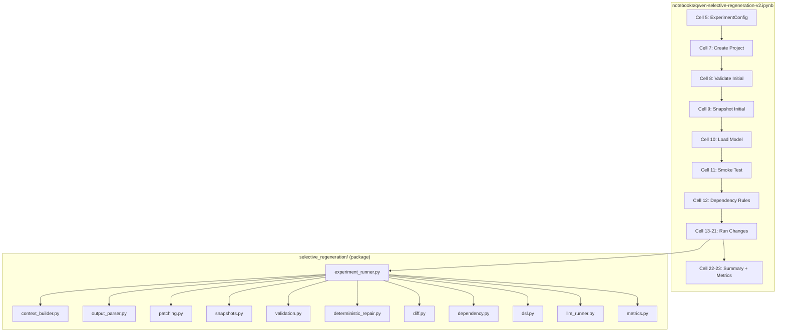

## Requirement Change Flow

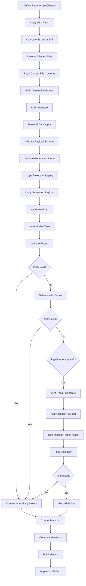

## Dependency Extraction

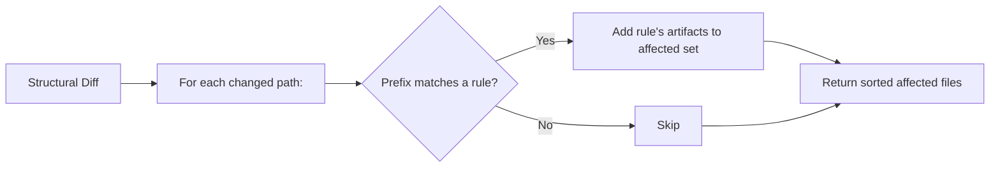

The dependency rules are a manually defined dictionary mapping DSL dotted-paths to lists of source files:

```python
{
    "entities.Task.fields": {
        "artifacts": ["app/models.py", "app/schemas.py", ...]
    },
    "actions.create_task": {
        "artifacts": ["app/schemas.py", "app/service.py", ...]
    },
    ...
}
```

When a DSL diff entry has a path starting with a rule prefix, all files in that rule's `artifacts` list become affected.

## Impact Analysis

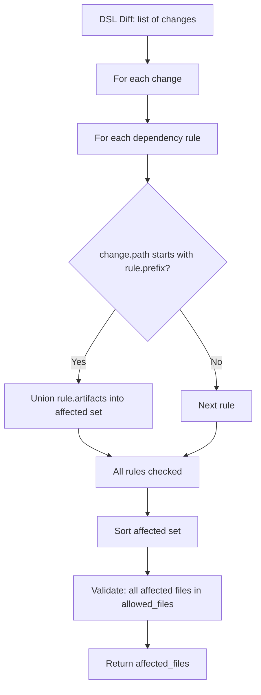

## Selective Regeneration

The core innovation is that only affected files are sent to the LLM, not the entire codebase.

```mermaid
sequenceDiagram
    participant Note as Notebook
    participant ER as experiment_runner
    participant CB as context_builder
    participant LLM as llm_runner
    participant OP as output_parser
    participant P as patching
    participant V as validation
    participant DR as deterministic_repair

    Note->>ER: run_selective_change(change)
    ER->>ER: Apply DSL patch, compute diff
    ER->>ER: Resolve affected files
    ER->>CB: build_generation_prompt(...)
    CB-->>ER: Prompt string
    ER->>LLM: generate_with_qwen(prompt)
    LLM-->>ER: GenerationResult
    ER->>OP: extract_json_object(text)
    OP-->>ER: payload dict
    ER->>OP: validate_payload_schema(payload)
    ER->>OP: validate_generated_scope(payload)
    ER->>P: apply_generated_payload(staging, payload)
    ER->>V: validate_project(staging)
    V-->>ER: validation result
    alt Validation failed
        ER->>DR: run_deterministic_local_repair(staging)
        DR-->>ER: repair report
        ER->>V: validate_project(staging)
        V-->>ER: validation result
    end
    ER->>ER: Create snapshot, compare manifests
    ER->>ER: Build metrics
    ER-->>Note: Result dict
```

## Artifact Validation

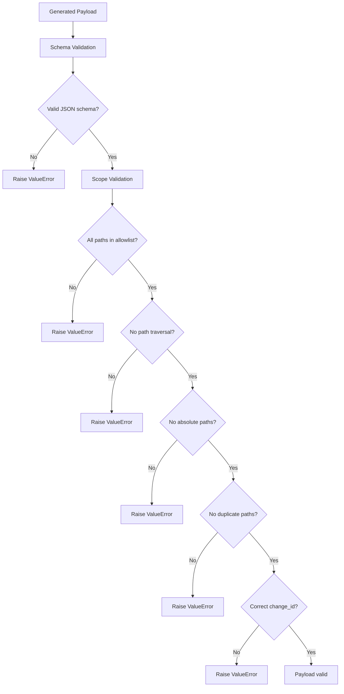

## LLM Generation

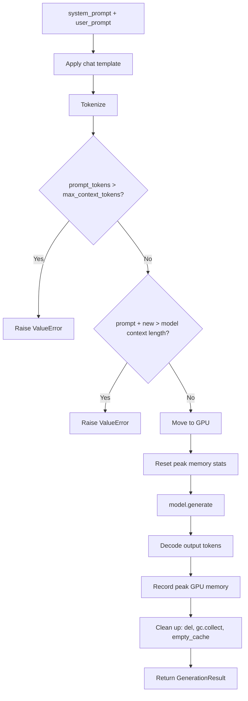

## Metrics Collection

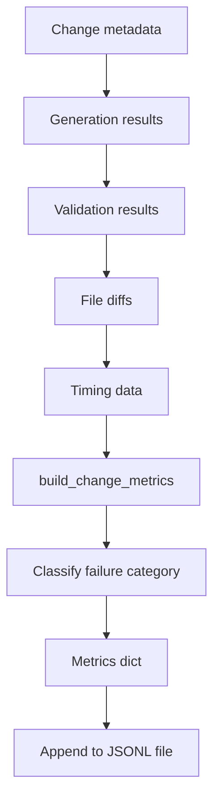

Each metrics record contains:

| Category | Fields |
|----------|--------|
| Identity | `change_id`, `version`, `change_title`, `experiment`, `project`, `strategy` |
| Input | `model_id`, `quantization`, `seed`, `changed_dsl_elements`, `affected_files_count` |
| Token usage | `initial_prompt_tokens`, `initial_output_tokens`, `initial_total_tokens`, `repair_prompt_tokens`, `repair_output_tokens`, `repair_total_tokens`, `total_tokens` |
| Timing | `generation_seconds`, `repair_seconds`, `total_duration_seconds` |
| Memory | `peak_gpu_memory_mb` |
| Outcomes | `first_pass_acceptance`, `accepted_after_local_repair`, `accepted_after_llm_repair`, `final_acceptance` |
| Stage results | `compile_pass`, `ruff_pass`, `unit_pass`, `integration_pass`, `regression_pass`, `hidden_tests_pass` |
| Classification | `failure_category` |

## Model Loading Architecture

### Discovery Phase

The model discovery process uses `debug_kaggle_models()` to locate candidate models on the host system. It searches well-known paths (e.g., `/kaggle/input/`) and applies a multi-stage validation pipeline before accepting a candidate:

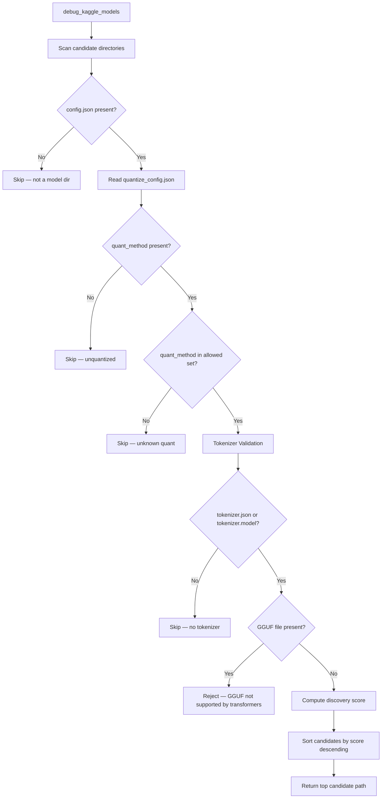

### Scoring

Each valid candidate is scored by path-keyword matching to select the best model when multiple are available:

| Criterion | Points | Rationale |
|-----------|--------|-----------|
| Path contains `qwen2.5-coder` | +50 | Primary target model |
| Path contains `qwen2` | +30 | Secondary Qwen match |
| Path contains `qwen` | +10 | Tertiary Qwen match |
| Path contains `gptq` | +40 | GPTQ quantized (preferred) |
| Path contains `int4` or `int-4` | +30 | INT4 variant |
| Path contains `awq` | +35 | AWQ quantized |
| Path contains `7b-instruct` | +15 | Instruct variant |
| Path contains `coder` | +10 | Coder variant |
| Path contains `7b` | +5 | 7B parameter size |
| Numeric version directory in path | +3 | Versioned model |
| No tokenizer files found | −50 | Hard disqualifier |
| GGUF directory | −∞ | Hard reject |

### Loading Phase

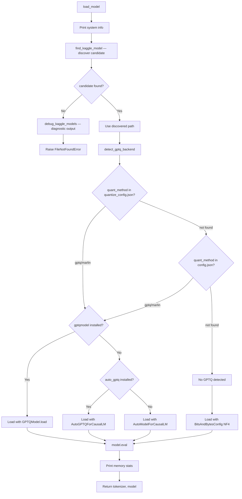

### Key Notes

- `debug_kaggle_models()` prints a diagnostic table of all scanned directories, their quant methods, tokenizer availability, and computed scores — useful for debugging model-not-found issues on Kaggle/Colab.
- GGUF files (e.g., `.gguf` quantized models) are explicitly rejected because the HuggingFace `transformers` library does not load them directly; they require `llama.cpp` or `gguf`-specific tooling.
- Tokenizer validation ensures `tokenizer.json` (fast tokenizer) or `tokenizer.model` (SentencePiece) exists. Without either, the model is skipped even if weights are present.
- When `gptqmodel` is installed, it is preferred over `auto-gptq` because it supports a wider range of GPTQ kernels and has better error messages.

## Validation Pipeline

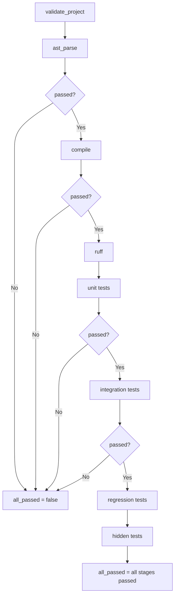

Note: `ast_parse`, `compile`, `unit`, and `integration` cause early termination on failure. `ruff`, `regression`, and `hidden` always run.

## Deterministic Repair Flow

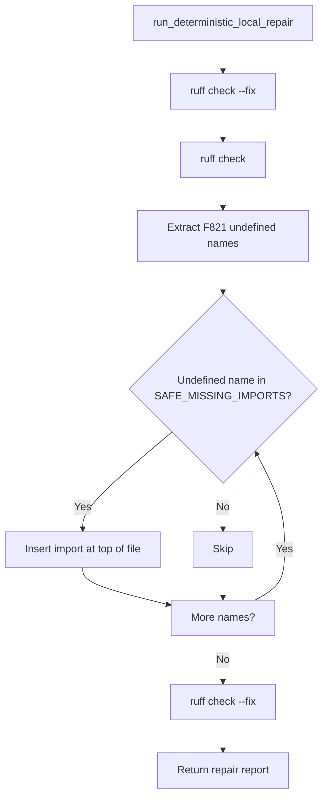
